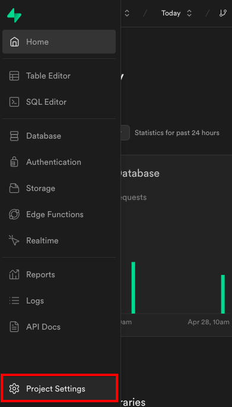
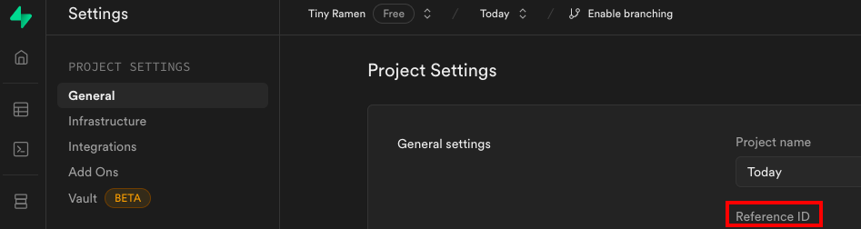

# today-server

This is the REST API server that leverages Supabase Functions for Today app authenticated customers.

## Setup

### Create new Supabase project

- [Create a new Supabase project](https://app.supabase.io/)
- Navigate to the [Auth settings](https://app.supabase.io/project/_/auth/settings) and turn off the toggle next to "Enable email confirmations". (Note: this is only for testing. In production please enable this setting!)
- Navigate to the [SQL Editor](https://app.supabase.io/project/_/sql) and run the SQL from the [schema.sql](./schema.sql) file.

### Setup env vars

- Set up env vars for Supabase Functions:
  - `cp .env.example .env`
  - Fill in your Stripe API keys from <https://docs.stripe.com/keys#obtain-api-keys>

### Supabase Functions

Supabase Functions are written in TypeScript, run via Deno, and deployed with the Supabase CLI. You have two options to install the Supabase CLI; you can either:

1. [Download](https://github.com/supabase/cli#install-the-cli) the latest version of the Supabase CLI, or [upgrade](https://github.com/supabase/cli#install-the-cli) it if you have it already installed.
1. Run `npm ci` (see [package.json](./package.json) for dependency details) (make sure you have a recent version of Node and npm installed on your development machine). This is not "globally-installed", so to use it you need to add `<present-working-directory>/node_modules/.bin` to your `PATH` environment variable. e.g. `export PATH="${PATH}:/Users/michaeldesenna/desenna/today-server/node_modules/.bin"`

Verify that the Supabase CLI is properly installed: `supabase --version`, then:

- Generate access token and log in to CLI
  - Navigate to <https://app.supabase.io/account/tokens>
  - Click "Generate New Token"
  - Copy newly created token
  - run `supabase login`
  - Input your token when prompted
- Link your project
  - Within your project root run `supabase link --project-ref <your-project-ref>`
  - To obtain `your-project-ref` from Supabase UI:
    1. Go to the `Today` project
    1. `Project Settings` -> `General` -> `Reference ID` -> `Copy` button

### Develop locally

- Run `supabase start --debug` (make sure your Docker daemon is running)
- Run `supabase functions serve hello`
  - NOTE: no need to specify `SUPABASE_URL` and `SUPABASE_ANON_KEY` as they are automatically supplied for you from the linked project.
- Stop local development
  - Kill the `supabase functions serve hello` (ctrl + c)
  - Run `supabase stop` to stop the Docker containers.

### Deploy

- Set up your secrets
  - Run `supabase secrets set --from-stdin < .env` to set the env vars from your `.env` file.
  - You can run `supabase secrets list` to check that it worked and also to see what other env vars are set by default.
- Deploy the function
  - Within your project root run `supabase functions deploy hello`

## 👁⚡️👁

For more info on Supabase Functions, check out the [docs](https://supabase.com/docs/guides/functions) and the [examples](https://github.com/supabase/supabase/tree/master/examples/edge-functions).
